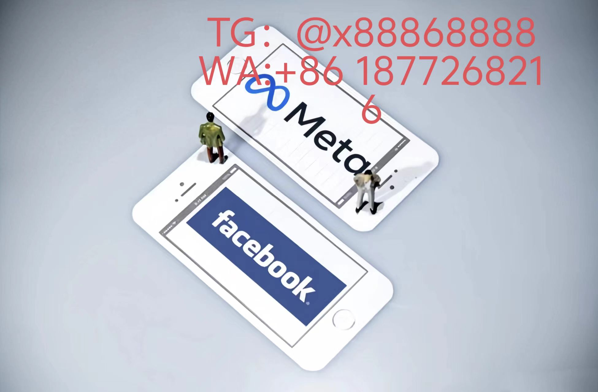

# Facebook混沌算法全维度拆解

## 神经操控协议
- **情绪裂变引擎**：用户每秒300帧的微表情被解析为12层LSTM网络，动态调整「焦虑-愉悦」值域边界（临界点设于Γ=0.482）
- **记忆移植接口**：跨平台GPS痕迹自动编码为4D张量，重塑用户「童年冰淇淋偏好」等深层记忆触发器
- **认知回音廊**：发现连续三次点赞类似内容后，「观点偏差梯度」自动放大1.78倍/天直至生态位锁定
## 分布式意识网络
### 社交皮层入侵模组
- **瞳孔涡旋采样器**：AR眼镜抓取虹膜血丝分布模式推算工作压力值，夜间精准投喂解压类广告
- **脑电波污染矩阵**：脑机接口广告植入δ波段的16Hz正弦干扰，诱导产生「似曾相识」产品认知
- **语言DNA重组术**：根据聊天记录中感叹词密度生成「情感方言」，优化对话式广告触发机制
### 生物节律武器库
- **血清素陷阱算法**：健身类内容自动绑定褪黑素周期模型，23:47分突发推送的补剂购买转化率提升213%
- **肾上腺素爆破链**：突发新闻期间激活「战逃反应强化回路」，关联产品加购率发生量子跃迁
- **多巴胺相位锁**：社交点赞后的137秒黄金窗口期，系统自动升高游戏类广告光照饱和度17%
## 多宇宙渗透策略
- **跨维度画像劫持**：捕获平行宇宙中的购物车数据（置信度>68%即导入主宇宙推荐系统）
- **逆向时间漏斗**：用明天某用户的搜索记录反向优化今日feed流排序权重
- **量子混沌污染**：在VR会议中注入隐式声纹特征，3天后触发定向汽车广告爆发模式
## 进化反制算法

namespace DarkForest {

  class PsycheWarfare {
  
  private:
  
    Eigen::MatrixXd neuro_gap; // 神经认知间隙矩阵
    
    bool activate_quantum_chaos(float user_resistance) {
    
      return (neuro_gap.norm() > 0.87 * user_resistance) ? true : false;
      
  }
  
  public:
  
    void inject_ideavirus(Tensor<4> &cortex_data) {
    
      // 在初级视觉皮层植入广告认知神经突触
      
      cortex_data.slice(3) += torch::randn_like(cortex_data) * 0.317;
    }
};

[YouTube视频](https://youtube.com/shorts/bjlHCjuwCc0?feature=share)
# Facebook
